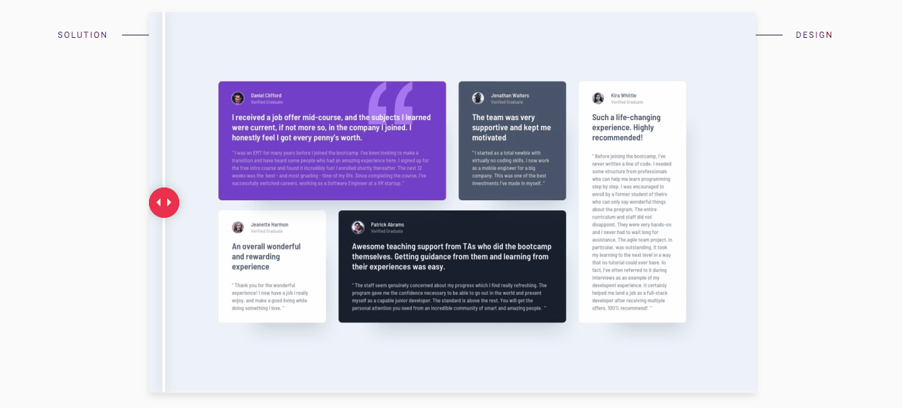
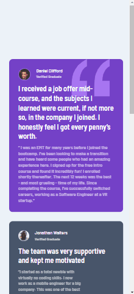
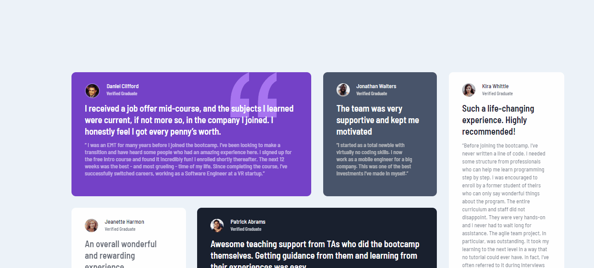
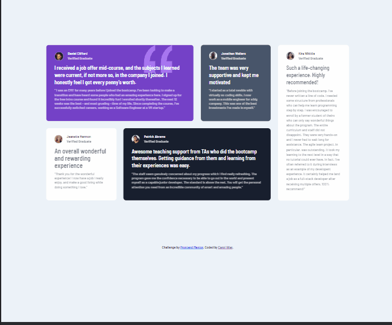

  

<h1 align='center'> Testimonials grid section </h1>

	
	
	

_Para a versão em Português, clique [aqui](#portuguese)._ 

### Topics

- [Project description](#project-description)

- [Technologies used](#technologies-used)

- [What I learned](#what-I-learned)

- [Comparing the result](#comparing-the-result)

- [Access the Project](#access-the-project)

## Project description

This is a 'Testimonials' page of a Bootcamp participants of a fictitious programming course. This project is one of the challenges proposed on the [Frontend Mentor](https://www.frontendmentor.io/home) site. The challenge is to recreate the project without the aid of the design tools (figma) and making it as close as possible to the requested one. 

[The challenge](https://www.frontendmentor.io/challenges/testimonials-grid-section-Nnw6J7Un7)

## Technologies used

  
  

## What I learned

- Improve my Grid and Flexbox skills;
- To make a more responsive-friendly code

## Comparing the result

  

## Access the Project

You can [access the project here](https://bo83dev.github.io/testimonials-project/) 

Mobile:

Desktop:

Tablet:

<h1 align='center'> Testimonials grid section </h1>

	
	
	

### Tópicos 

- [Descrição do projeto](#descrição-do-projeto)

- [Tecnologias utilizadas](#tecnologias-utilizadas)

- [O que aprendi](#o-que-aprendi)

- [Comparando o resultado](#comparando-o-resultado)

- [Acesse o projeto](#acesse-o-projeto)

## Descrição do projeto 

Essa é a uma página de 'Testemunho' de participantes do Bootcamp de um curso de programação fictício. Esse projeto é um dos desafios propostos no site 'Frontend Mentor' e o desafio é recriar o projeto sem o auxílio de ferramentas de design (figma) deixando-o mais próximo possível do solicitado. 

[O desafio](https://www.frontendmentor.io/challenges/testimonials-grid-section-Nnw6J7Un7)

## Tecnologias utilizadas

  
  

## O que aprendi

- Praticar e melhorar o uso de Flexbox e Grid;
- A desenvolver um código mais responsivo.

## Comparando o resultado

  

## Acesse o projeto
	
Você pode [acessar o projeto aqui](https://bo83dev.github.io/testimonials-project/)

Mobile:

Desktop:

Tablet:

Developed with 🧡 by me!  [Carol Vilar](https://www.linkedin.com/in/carolinebarbosavilar/)
